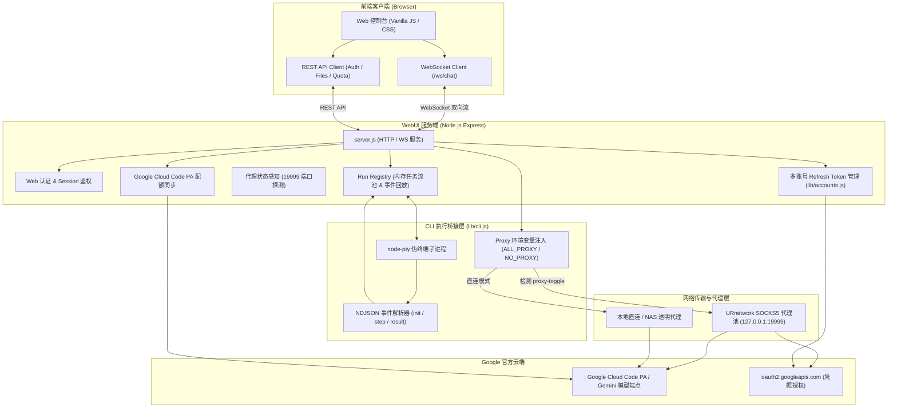

# 🌌 Google Antigravity WebUI

<div align="center">


**新一代基于 Google Antigravity CLI (`agy` / `antigravity`) 的现代化全功能 Web 控制台与多模型网关**

*专为自建服务器、私有云及 NAS（群晖、TrueNAS、极空间等）环境打造的私有化 AI 编程助手与对话平台*

[功能特性](#-功能特性) • [系统架构](#-系统架构) • [快速开始](#-快速开始) • [代理与网络保活](#-代理与全球网络保活) • [配置说明](#-配置说明) • [常见问题](#-常见问题与运维)

</div>

---

## 📖 简介

**Google Antigravity WebUI** 是一个轻量、稳定且功能强大的服务端 Web 界面，深度包装官方 [Google Antigravity CLI](https://antigravity.google)。

通过 **WebSocket 双向流**、**Run Registry 后台脱机保活**、**全球分布式 SOCKS5 代理路由** 以及 **直连 Google Cloud Code PA 的多账号配额引擎**，彻底解决了远程无界面服务器运行 Antigravity 的痛点，提供媲美原生 IDE 的全功能多轮对话、自动化编程、权限控制与文件管理体验。

---

## ✨ 核心特性

### 1. 🧠 全模型矩阵与深度思考
- **多模型原生拉取**：开箱即用支持 `Gemini 2.5 Pro`、`Gemini 2.5 Flash`、`Gemini 3.8`、`Claude 3.7 Sonnet`、`Claude 3.5 Sonnet`、`GPT-OSS` 等全系模型。
- **思考强度自由调节**：无缝映射 CLI `--effort low / medium / high`，按需分配推理预算。
- **真会话上下文保留**：调用官方 `--conversation <id>` 会话续接机制，服务端状态全生命周期维持，无需前端拼接历史记录。

### 2. ⚡ 工业级实时流与断线恢复
- **纯 WebSocket 传输架构**：彻底放弃 SSE（Server-Sent Events），杜绝 Nginx 等反向代理因长轮询缓冲、超时强拆导致的连接中断。
- **Run Registry 脱机保活**：用户端浏览器关闭、刷新或网络波动不中断后台任务，CLI 进程在后台持续编排。
- **全自动回放与无感重连**：页面刷新后自动扫描并挂载正在执行的任务，实时回放错过的事件流，无缝续接思考过程与终端交互。
- **node-pty 真实伪终端**：分配专用 PTY 管道，完美兼容多工具编排与终端原生交互，告别非 TTY 环境下的 `Agent execution terminated` 错误。

### 3. 🌐 全球 86 国分布式代理与自愈引擎
- **URnetwork 分布式节点接入**：直连本地 19999 SOCKS5 聚合端口，涵盖全球 86 个国家与数万个活跃节点。
- **Google 官方更新免疫**：代理环境变量与守护机制解耦注入。即便 Google 后续自我更新 `antigravity` 二进制，网络代理与保活机制丝毫不受影响。
- **动态开关与直连分流**：通过 `proxy-toggle.txt` 实现直连与代理秒级热切换；内部通信自动配置 `NO_PROXY`，杜绝内网 IPC 环回被代理挟持。

### 4. 📊 实时配额与多账号管家
- **直连 Google Cloud Code PA API**：高频实时抓取 Google 官方配额状态，精准展示 **5 小时滚动窗口** 及 **每周配额** 消耗百分比与重置倒计时。
- **账号级别与身份标识**：直观呈现 Google 头像、邮箱身份以及当前 Tier（Pro / Enterprise / Free）。
- **多账号热插拔无感切换**：内置独立 Google OAuth Refresh Token 刷新链路，多账号一键秒级切换，全自动轮换本地凭据。

### 5. 🛡️ 细粒度权限安全体系
- **🟢 自动批准模式**：启动 `--dangerously-skip-permissions`，完全自动化执行文件读写与终端命令。
- **🟡 交互式询问模式**：工具执行前智能阻断，Web 界面弹出可视化授权面板；支持“允许并记住”，一键持久化至 `settings.json` 白名单。
- **独立 Web 访问认证**：内置 Session 会话隔离与密码认证，防范公网未授权访问。

### 6. 📁 云端工作区与多模态交互
- **文件树与在线编辑器**：内置目录树状导航，支持轻量代码在线阅读、语法高亮与实时保存。
- **多模态附件解析**：拖拽上传图片与文档（≤10MB），通过 `<images_input>` 与 `<files_input>` 语义标记精准注入提示词。
- **语音转写支持**：集成语音文件接收与文本转换接口，实现多模态交互闭环。

---

## 🏗️ 系统架构



---

## 🚀 快速开始

### 1. 环境准备

| 依赖项 | 推荐要求 | 说明 |
|---|---|---|
| **Node.js** | `>= 18.0.0` (推荐 Node 20 LTS) | 后端运行时 |
| **npm** | `>= 8.0.0` | 包依赖管理器 |
| **Antigravity CLI** | `>= 1.1.0` | 官方 CLI 核心工具 (`agy` / `antigravity`) |
| **操作系统** | Linux (Ubuntu / Debian / CentOS / Synology DSM) / macOS | 完整支持 PTY 虚拟终端 |

### 2. 安装与初次配置

```bash
# 1. 克隆代码仓库
git clone https://github.com/djsevenx1/google-antigravity-webui.git
cd google-antigravity-webui

# 2. 安装项目依赖
npm install

# 3. 复制并调整配置文件
cp config.json.example config.json
```

修改 `config.json` 中的安全配置：
```json
{
  "port": 3100,
  "sessionSecret": "自定义一段长随机字符串以保障会话安全",
  "auth": {
    "username": "admin",
    "password": "请修改为强密码"
  }
}
```

### 3. 启动运行

#### 方式 A：生产守护启动（推荐）
内置的 `keepalive.sh` 会在主进程异常退出时 **2 秒自动重启**，并动态读取代理配置：

```bash
# 后台启动并守护
PORT=3100 nohup bash keepalive.sh >> server.log 2>&1 &

# 检查运行日志
tail -f server.log
```

#### 方式 B：直接启动
```bash
npm start
# 或
node server.js
```

### 4. 访问控制台

在浏览器中打开：
```
http://<你的服务器IP>:3100
```
使用 `config.json` 中配置的账号密码登录即可进入现代化工作台。

---

## 🌐 代理与全球网络保活

为了应对部分地区访问 Google API 的网络限制，本项目设计了完善的分布式代理接入与防封锁体系。

### 1. 架构特点
- **统一接入端口**：代理池聚合在本地 `127.0.0.1:19999`，后端自动感知监听状态。
- **86 国出口自适应**：支持查看当前出口国家（如美国、日本、英国等）与活跃节点数量。
- **版本解耦抗更新**：Google Antigravity 官方 CLI 自身具有自动升级机制。因为代理环境变量（`ALL_PROXY`, `HTTPS_PROXY`, `HTTP_PROXY`, `NO_PROXY`）是在 CLI 每次被子进程唤起时由 `lib/cli.js` 动态注入的，**无论官方二进制如何自我更新覆盖，代理能力均不受任何影响**。
- **内网免代理保护**：通过设置 `NO_PROXY="127.0.0.1,localhost,::1"`，保障本地进程通信、端口回调均不走外部代理隧道。

### 2. 动态切换模式

在项目根目录下，通过修改 `proxy-toggle.txt` 文件内容，即可无重启切换网络通道：

| 文件内容 (`proxy-toggle.txt`) | 生效模式 | 说明 |
|---|---|---|
| `yes` 或 `true` 或 `on` | **SOCKS5 代理模式** | 所有 CLI 流量与 Google 通信路由至 `127.0.0.1:19999` |
| `no` 或 `false` 或 `off` | **直连模式** | 流量直连，适用于服务器自带透明代理 / 全局 VPN 环境 |

---

## ⚙️ 核心配置与环境变量

### 环境变量

| 变量名 | 类型 | 说明 | 默认值 |
|---|---|---|---|
| `PORT` | 整数 | 服务监听端口 | `3100` |
| `AGY_BIN` | 字符串 | 明确指定 CLI 二进制路径 | 自动探测系统 `agy` / `antigravity` |
| `AGY_SESSION_SECRET` | 字符串 | Express Session 签名密钥 | `dev-insecure-secret` |
| `GOOGLE_CLIENT_ID` | 字符串 | 自定义 Google OAuth 客户端 ID | 可选，优先读取 `data/.google_creds` |
| `GOOGLE_CLIENT_SECRET`| 字符串 | 自定义 Google OAuth 客户端密钥 | 可选，优先读取 `data/.google_creds` |

### 配置文件 `config.json`

```json
{
  "port": 3100,
  "agyBin": "",
  "sessionSecret": "your-session-secret",
  "auth": {
    "username": "admin",
    "password": "your-secure-password"
  },
  "defaultModels": [
    "gemini-2.5-pro",
    "gemini-2.5-flash",
    "gemini-3-pro",
    "claude-sonnet-4-20250514"
  ]
}
```

---

## 🌐 Nginx 反向代理配置

如需通过公网或自定义域名访问 WebUI，建议使用 Nginx 反向代理。**注意：必须正确配置 WebSocket 协议升级，否则对话流将被掐断。**

```nginx
server {
    listen 80;
    server_name your-antigravity-domain.com;

    # 推荐重定向到 HTTPS
    return 301 https://$host$request_uri;
}

server {
    listen 443 ssl http2;
    server_name your-antigravity-domain.com;

    ssl_certificate     /path/to/fullchain.pem;
    ssl_certificate_key /path/to/privkey.pem;

    client_max_body_size 50M;

    location / {
        proxy_pass http://127.0.0.1:3100;
        proxy_http_version 1.1;

        # WebSocket 关键升级头
        proxy_set_header Upgrade $http_upgrade;
        proxy_set_header Connection "upgrade";

        # 客户端真实信息透传
        proxy_set_header Host $host;
        proxy_set_header X-Real-IP $remote_addr;
        proxy_set_header X-Forwarded-For $proxy_add_x_forwarded_for;
        proxy_set_header X-Forwarded-Proto $scheme;

        # 超时设置（避免对话长轮询断开）
        proxy_read_timeout 86400s;
        proxy_send_timeout 86400s;
        proxy_buffering off;
    }
}
```

---

## 📁 目录结构

```
google-antigravity-webui/
├── server.js               # 服务端核心：Express REST API + WebSocket 路由器
├── keepalive.sh           # 工业级守护进程：崩溃秒级拉起与代理环境注入
├── start.sh               # 快捷启动脚本（自动环境自检与依赖拉取）
├── proxy-toggle.txt       # 网络代理热切换开关 (yes/no)
├── package.json           # 项目元数据与依赖清单
├── config.json.example     # 基础配置模板
├── lib/
│   ├── cli.js             # CLI 桥接引擎：node-pty 进程管理、事件解析与环境变量注入
│   ├── cli-login.js       # WebUI 贴码 OAuth 授权中间件
│   ├── accounts.js        # 多 Google 账号 Token 管理与直接刷新引擎
│   ├── proxy.js           # 代理网络状态嗅探与检测
│   ├── bringyour-locations.js # 全球 86 国代理节点池分布统计
│   ├── permissions.js     # 细粒度工具执行权限管理 (settings.json allow/deny)
│   ├── oauth.js           # OAuth 回调服务
│   └── config.js          # 配置加载器
├── public/                # 现代化纯原生单页前端应用
│   ├── index.html         # Web 控制台单页入口
│   ├── app.js             # 前端主逻辑：WebSocket 客户端、任务状态机、HUD 监控
│   ├── style.css          # 暗色现代风格样式系统
│   └── vendor/            # 第三方轻量库 (marked, highlight.js, lucide icons)
└── data/                  # 本地持久化数据存储目录（gitignored）
    ├── sessions/          # 用户多轮会话存档
    └── accounts.json      # 多账号凭据存储
```

---

## ❓ 常见问题与运维

### Q1: 刷新页面后任务会中断吗？
不会。本系统实现了 **Run Registry（脱机运行注册表）**，任务由服务端底层的后台子进程持续编排。当用户刷新页面或网络闪断重连时，前端会自动执行 `tryReconnectToOngoingRun`，请求后端回放所有错过的流式事件，并无缝接管后续的实时输出。

### Q2: 为什么我的代理状态显示“未监听 (:19999)”？
请检查本地的 SOCKS5 代理守护程序是否已启动。可通过执行以下命令确认：
```bash
curl -x socks5h://127.0.0.1:19999 https://www.google.com -I
```
如果返回 `HTTP/2 200`，说明代理服务运作正常；若提示 Connection refused，请检查守护脚本或将 `proxy-toggle.txt` 修改为 `no`（直连模式）。

### Q3: CLI 被 Google 官方自动更新后，WebUI 还能用吗？
完全没有影响。WebUI 通过调用系统路径下的可执行文件（或 `AGY_BIN`），并在每次调用前动态注入专属的环境变量与管道参数，即便二进制更新换代，调用层依然保持无缝兼容与隔离。

### Q4: 如何重置或修改 Web 登录密码？
直接修改项目根目录下的 `config.json` 文件：
```json
{
  "auth": {
    "username": "new_admin",
    "password": "new_password"
  }
}
```
保存后，服务会在下次请求或重启后直接生效。

---

## 📄 开源许可证

本项目基于 [MIT License](LICENSE) 开源发布。
